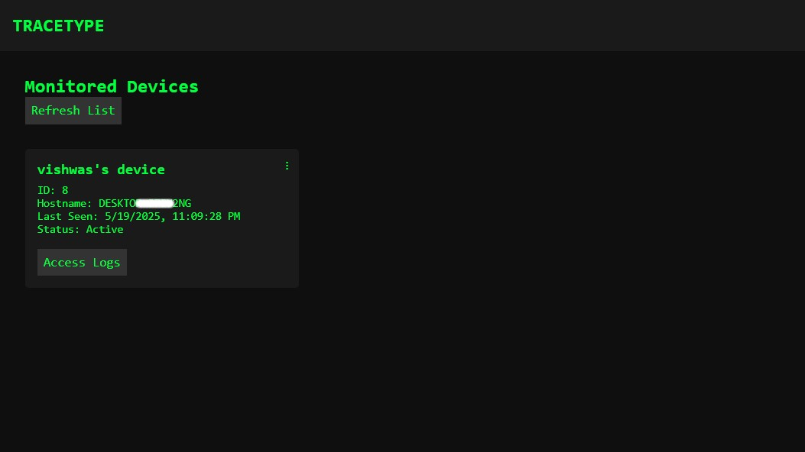
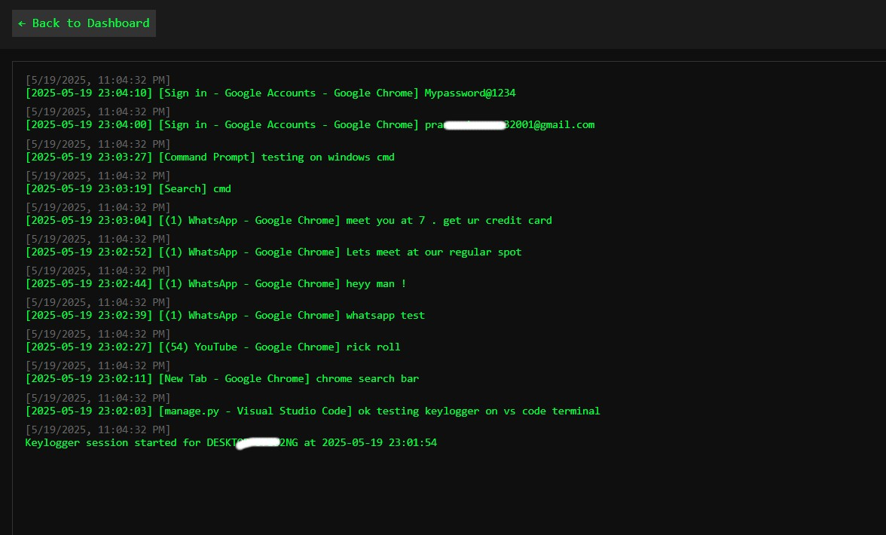

# TRACETYPE - Keystroke Monitoring & Analysis Dashboard

## Project Overview

TRACETYPE is an educational project designed to demonstrate the concepts behind keystroke logging, secure data transmission, client-server architecture, and web-based data visualization. It consists of:

1.  **Python Keylogger Client (`keylogger2.py`):** Captures keystrokes on a target machine, encrypts them, and sends them to a central server.
2.  **Django Web Backend:** Receives encrypted logs, decrypts them, stores them in a database, and provides an API for data retrieval.
3.  **Web Dashboard:** A custom HTML/CSS/JavaScript frontend that communicates with the Django backend's API to display monitored devices and their corresponding keystroke logs in a user-friendly interface.
4.  **Django Admin Panel:** Provides administrative oversight for managing devices and logs.

**This project was developed for educational purposes to explore cybersecurity principles, Python scripting, and full-stack web development with Django.**

---

## ⚠️ ETHICAL CONSIDERATIONS & DISCLAIMER ⚠️

**WARNING: Unauthorized installation or use of keylogging software on a device without the explicit, informed consent of the device owner is illegal and unethical in most jurisdictions. This tool should NOT be used for any malicious, unauthorized surveillance, or any other illegal purposes.**

*   This project is intended strictly for educational and research purposes to understand how such systems work and the associated security implications.
*   Always obtain explicit, written consent from the owner of any device before installing or running any monitoring software, including this one.
*   Be aware of and comply with all applicable local, state, national, and international laws regarding privacy and computer usage.
*   The user of this software assumes all responsibility and liability for its use. The author(s) of this project are not responsible for any misuse of this software or any damages that may result from its use or misuse.

---

## Features

*   **Remote Keystroke Capture:** Logs keystrokes from monitored devices.
*   **Active Application Logging:** (Windows) Logs the title of the active application where keystrokes are typed.
*   **Secure Log Transmission:** Keystroke data is encrypted using Fernet (AES-128-CBC) before being sent to the server.
*   **Device Identification:** Devices are identified by their hostname, with automatic registration upon first log submission.
*   **Centralized Django Backend:**
    *   Stores device information and encrypted logs.
    *   Decrypts logs for display.
    *   Provides RESTful API endpoints for frontend interaction.
*   **Custom Web Dashboard:**
    *   Displays a list of monitored devices.
    *   Allows viewing detailed, decrypted keystroke logs per device.
    *   (Future/Optional: Device renaming, log deletion from dashboard).
*   **Django Admin Panel:**
    *   Full administrative control to view devices and their logs.
    *   Ability to rename devices for easier identification.
    *   Ability to delete devices and logs.

---

## Technologies Used

*   **Backend:**
    *   Python 3.x
    *   Django (e.g., 4.2.x)
    *   Cryptography (for Fernet encryption)
    *   SQLite (default database for local development)
*   **Keylogger Client (`keylogger2.py`):**
    *   Python 3.x
    *   `pynput` (for keyboard listening)
    *   `requests` (for HTTP communication)
    *   `cryptography` (for Fernet encryption)
    *   `pygetwindow` (optional, for active window title on Windows)
*   **Frontend Dashboard:**
    *   HTML5
    *   CSS3
    *   JavaScript (Vanilla JS, for API calls and DOM manipulation)
*   **Version Control:** Git & GitHub

---

## Screenshots

**(Embed your screenshots here. You can upload them to your GitHub repo and link them, or use Markdown image syntax if they are in the repo.)**

*Example:*
*   *Dashboard View:*

    

    
   

*   *Django Admin - Monitored Devices:*
    
   

## Local Setup and Installation (Brief)

**Prerequisites:**
*   Python 3.8+
*   `pip` (Python package installer)
*   Git

**1. Clone & Setup Environment:**
   
     *git clone https://github.com/YOUR_USERNAME/YOUR_REPOSITORY_NAME.git
     *cd YOUR_REPOSITORY_NAME
  
     *pip install -r requirements.txt
**2. Configure Secrets:**

   *   **Generate a Fernet Key:**

   *   **Generate a Django Secret Key:**
        Create a long, random, unique string for your Django `SECRET_KEY`. You can use an online generator or create one with Python 

   *   **Set Keys (Modify Files Directly for Local Testing):**
      1.  Open `tracetype/tracetype/settings.py` and modify the placeholder with your key 
          *   Replace the placeholder for `SECRET_KEY` with your generated Django secret key (as a string).
             *Example:* `SECRET_KEY = "your_long_random_django_secret_key_here"`        
             *Example:* `FERNET_KEY = b"your_generated_fernet_key_bytes_from_above"`
   2.  Open `keylogger2.py`:
          *   Replace the placeholder for `KEY` with the **same** Fernet key (as bytes) that you used in `settings.py`.

**3. Initialize Database & Admin User:**
   
    * python manage.py migrate
    * python manage.py createsuperuser

**4. Run the system**
     Open two terminals in project directory and run 
     *python3 manage.py runserver 
     *python3 keylogger2 

Your keylogger activates and logs are captured in dashboard ! 
